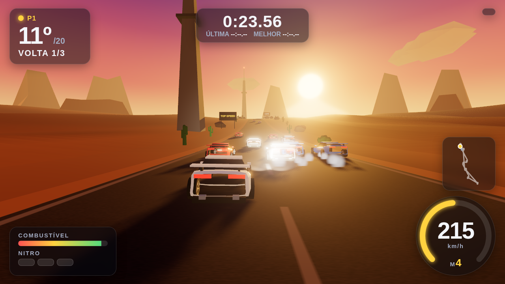
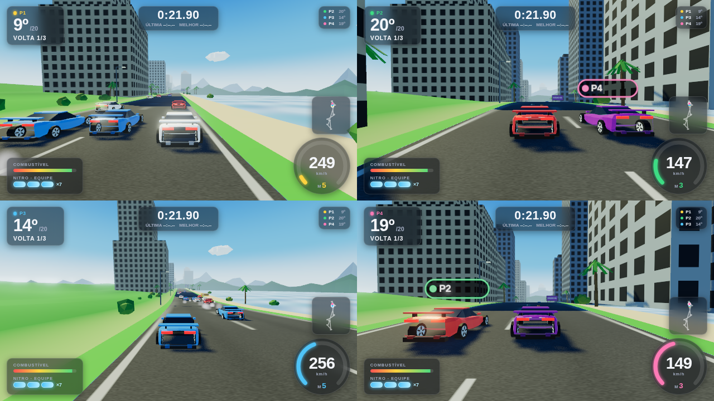

# Nitro Crew *(nome provisório)*

Corrida arcade no espírito do Top Gear (SNES) com visual **3D atual, low-poly estilizado** (referência:
Horizon Chase Turbo), e **cooperativo local para até 4 jogadores em tela dividida**: a equipe divide um cofre
de nitro, empurra o companheiro que parou, ganha vácuo atrás dele e pontua junta nas copas contra 19 pilotos
de IA. Tem carreira com dinheiro e melhorias, 32 pistas em 8 países e jogo online por lockstep. Feito em
TypeScript + Three.js (WebGL), com simulação determinística, e empacotável com Electron para a Steam.




## Jogar agora

```bash
npm install
npm run dev        # abre em http://localhost:5174
```

Versão otimizada: `npm run build` e `npm run preview` (porta 4174).

## Como jogar (resumo)
- **Menu principal**: Campeonato, Carreira, Corrida rápida, Contra-relógio, Online, Recordes, Opções, Controles
  (e Continuar, quando há copa ou carreira salva). No lobby, cada pessoa entra apertando um botão: teclado 1
  (setas, Enter), teclado 2 (WASD, F) ou um controle (A/Start). Escolha o carro e marque "pronto".
- **Controles padrão** (todos remapeáveis em Controles, por dispositivo): teclado 1 com setas, **Espaço** nitro,
  **M/N** marcha, **Esc** pausa; teclado 2 com WASD, **F** nitro, **E/Q** marcha; controle com analógico/d-pad,
  A ou RT acelera, X/B/LT freia, RB nitro, Y/LB marcha, Start pausa. Controles vibram em batidas, nitro e grama.
- **Nitro**: 3 por corrida (no co-op, cofre da equipe). **Combustível**: o aviso de "entre no box" chega quando o
  tanque não garante mais uma volta a fundo; o box fica à direita da reta de largada. **Curva forte pede freio**.
- **Campeonato**: 8 copas de 4 pistas, destravadas em sequência. Solo/versus: termine entre os 5 para seguir;
  co-op: a equipe (2 melhores) precisa ficar entre as 3 melhores equipes. A copa é salva a cada corrida.
- **Carreira**: prêmio em dinheiro por corrida (carteira única no co-op), garagem com 6 melhorias por carro e 4
  carros novos para comprar; os rivais evoluem copa a copa. Regras em `docs/CARREIRA.md`.
- **Online**: até 4 jogadores em computadores diferentes (1–2 por computador) numa sala com código, pelo servidor
  de retransmissão (`npm run relay`). Detalhes e hospedagem em `docs/ONLINE.md`.

## Conteúdo
- 32 pistas em 8 países (Brasil, EUA, Japão, Europa, África do Sul, Austrália, Escandinávia, Mediterrâneo), 6
  cenários × dia/entardecer/noite (`docs/PISTAS.md`).
- 8 carros (4 livres, 4 da carreira) com trocas claras de velocidade, aceleração, curva e consumo.
- 19 pilotos de IA em 10 equipes, 3 dificuldades, elástico, nitro e box pelo consumo medido volta a volta.
- Estatísticas por jogador, recordes por pista e 24 conquistas (`docs/ESTATISTICAS.md`).
- Visual 3D com iluminação, sombras, bloom, névoa, céu dinâmico, partículas e carros low-poly (procedural até a arte final).
- Tela dividida 1–4, minimapa, HUD por jogador, PT-BR/EN, jukebox procedural com 4 músicas.

## Desenvolvimento

```bash
npm run typecheck              # TypeScript estrito
npm test                       # vitest (~560 testes, ~1 min): núcleo, IA, corridas inteiras por pista, carreira, online, UI pura
(cd server && npm ci) && NC_REQUIRE_RELAY=1 npm test   # inclui a integração com o relay de verdade (o CI roda assim)
npm run smoke -- copacabana 2  # corrida completa sem interface (pista, nº de humanos em piloto automático)
npm run balance -- 150         # IA × IA em todas as pistas: voltas, grama, batidas, tempo de CPU
npx tsx scripts/career-balance.ts   # calibragem da carreira (dinheiro × rivais) com corridas inteiras
npm run relay                  # servidor do online (porta 8787)
npm run preview                # e, em outro terminal, os playtests no Chromium (capturas em scratch/):
node scripts/playtest.mjs            # fluxo geral: menus, lobby, corrida, pausa, resultado, tela dividida
node scripts/playtest-online.mjs     # dois computadores no mesmo relay, hash do lockstep, queda e volta
node scripts/playtest-controls.mjs   # remapeamento, captura, vibração com gamepad falso
node scripts/pistas-ui.mjs           # telas de copas e pistas em vários tamanhos
```

Estrutura: `src/core` (simulação, sem DOM) · `src/render` (Three.js) · `src/ui` (menus/entrada) · `src/audio` ·
`src/net` (online) · `src/game` (sessão, carreira, estatísticas, save, erros) · `server/` (relay) · `desktop/`
(Electron/Steam) · `docs/` (design, roteiro, loja, legal, QA).

## Roteiro
Concluído: fatia vertical, 32 pistas, carreira, controles remapeáveis, online por lockstep, estatísticas e
conquistas, build Electron, relatório de erros, textos de loja/legal/QA. Próximos: rivais com personalidade,
assistências e acessibilidade, modos de festa, tutorial, fantasma do contra-relógio; depois a arte e a trilha
finais e a página da Steam. Cronograma completo em `docs/ROADMAP.md`.

## Licença
⚠️ A definir: hoje o `package.json` diz MIT e o repositório é público, mas o jogo será vendido com a EULA
comercial de `docs/legal/EULA.md`. Decisão pendente do dono (ver `docs/ROADMAP.md`, riscos).
